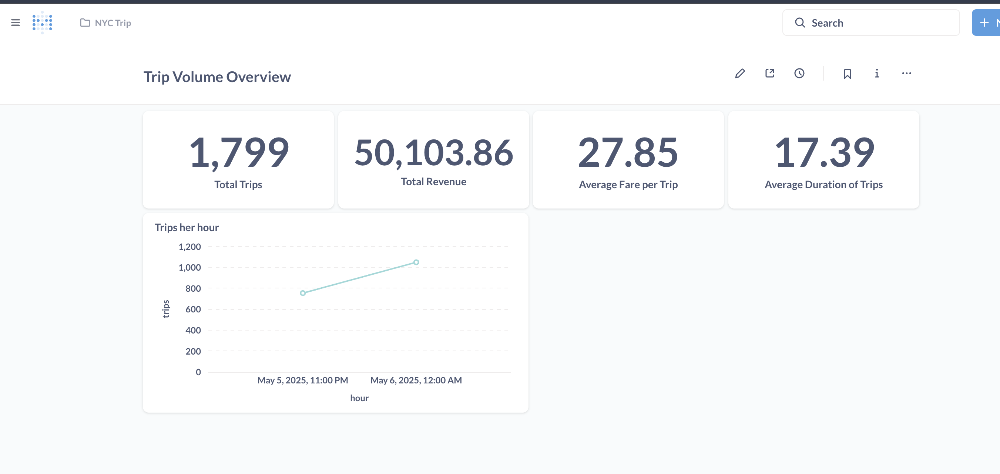

# NYC Taxi Ride Streaming ETL Pipeline

A real-time data pipeline that simulates ingesting New York City taxi ride events via Kafka, processes them with Apache Spark, stores the results in PostgreSQL, and visualizes insights through Metabase dashboards.


## Problem:

Modern data platforms demand the ability to process, analyze, and visualize data in near real-time. Traditional batch pipelines introduce latency, which limits timely decision-making for dynamic systems like transportation, logistics, and mobility services.

This project simulates NYC taxi rides to demonstrate how real-time ingestion, transformation, and analytics can be achieved using open-source tools. The objective is to process live trip data as it arrives, store it efficiently, and surface meaningful insights through dashboards.


## Tech Stack:

This architecture was chosen to showcase a realistic and production-ready streaming ETL pipeline:

- Apache Kafka: Acts as the backbone for real-time data ingestion. Its publish-subscribe model and scalability make it ideal for streaming use cases.

- Apache Spark Structured Streaming: Offers fault-tolerant, scalable stream processing. We use it to parse, clean, and enrich incoming Kafka data in micro-batches.

- PostgreSQL: A widely used open-source relational database for persistent storage, suitable for both transactional and analytical workloads.

- Metabase: Chosen for its simplicity and power as an open-source BI tool. It connects directly to Postgres and enables rapid creation of insightful dashboards without writing custom front-end code.

- Docker Compose: Simplifies multi-container orchestration and environment setup, ensuring reproducibility and easy local testing.


## Components

| Component             | Purpose                                     |
|-----------------------|---------------------------------------------|
| Kafka Producer        | Simulates live taxi ride events 
| Spark Streaming       | Consumes, parses, and processes Kafka events 
| PostgreSQL            | Stores processed ride data 
| Metabase              | Visualizes metrics and KPIs 
| Docker Compose        | Runs the entire stack locally 


## Getting Started

### 1. Clone the Repository

```bash
git clone https://github.com/your-username/nyc-taxi-streaming-etl.git
cd nyc-taxi-streaming-etl

### 2. Start the docker containers
docker-compose up --build

###3. Submit the spark streaming job
In the new terminal run:
spark-submit --master local[*] spark/streaming_job.py

###4. Explore  Metabase
Open Metabase at http://localhost:3000
Set up the connection to Postgres:

Host: postgres

Port: 5432

DB: taxi_rides

User: taxi

Password: taxi123


Sample Image from the Metabase

